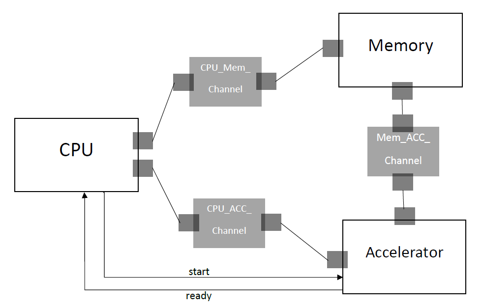

# MLP Neural Network Implementation in SystemC (Approximately-Timed)

  
  
  

## 📖 Overview

This repository contains the hardware-software co-design simulation of a **Multi-Layer Perceptron (MLP)** neural network using **SystemC**. The architecture utilizes **Approximately-Timed (AT)** modeling to simulate the digital system's timing and synchronization accurately, without the extreme computational overhead of Cycle-Accurate models.

This implementation emphasizes modularity, concurrent execution, and precise data routing among processing components to evaluate the timing and architectural behavior of ML hardware accelerators.

---

## ✨ Key Features

- **Approximately-Timed Modeling:** Implements robust TLM-2.0 AT timing annotations (`sc_time`, `wait()`, Payload Event Queues) to simulate real-world hardware delays (Processing, Transport, PEQ, and Response delays).
- **Decoupled Architecture:** Utilizes robust SystemC `Interfaces` and `Channels` to separate module specifications from their underlying data-transfer implementations.
- **Three-Tier Architecture:** Comprises a coordinating **CPU**, a multi-stage **Accelerator**, and a primary **Memory** module.
- **Dynamic Topology Loading:** Capable of reading neural network configurations (layer sizes, weights, biases, and input vectors) dynamically from CSV files.

---

## 🏗️ System Architecture

![[Pasted image 20260903192002.png]]

The project is structured around three primary modules that communicate via tightly synchronized custom channels:

### 1. CPU (Central Processing Unit)
Acts as the system's main controller.
- Waits for the memory to load configurations and input data.
- Dispatches layer configurations and inputs to the Accelerator.
- Triggers the execution of each network layer.
- Collects the final output post-execution and routes it back to Memory for storage.
- Relies on SystemC synchronization primitives (`sc_event`, `wait()`, `notify()`) to ensure collision-free data processing.

### 2. Memory
Simulates the external/main memory storage.
- **Initialization:** Loads network topology and initial inputs from `mlp_data.csv`.
- **Data Serving:** Answers Accelerator requests by providing layer-specific weights and biases during calculation phases.
- **Data Sink:** Receives the final computed neural network output from the CPU and writes it to `output.csv`.

### 3. Accelerator
The core computational engine of the MLP.
- Receives execution signals from the CPU.
- Iteratively requests necessary weights and biases from Memory for each layer.
- Executes matrix multiplication (Dot Product) and applies the **ReLU** activation function.
- Asserts a completion signal to the CPU upon finishing a layer, passing the hidden state forward until the final output is reached.

---

## ⏱️ Approximately-Timed Modeling

To balance simulation speed with cycle accuracy, this system leverages the **Approximately-Timed  abstraction level.

Unlike *Loosely-Timed (LT)* models  or *Cycle-Accurate (CA)* models ,the AT model injects explicit timing margins into transaction phases. 

### Simulated Delays:
- **Processing Delay:** The time a target needs to process a request.
- **Transport Delay:** The transmission time across channels between modules.
- **PEQ (Payload Event Queue) Delay:** Delays caused by transaction scheduling within the target's queue.
- **Response Delay:** The duration from the start to the completion of a response transmission.

### Modeling Comparison Matrix
| Abstraction Level | Accuracy | Simulation Speed | Communication Interface | Timing Granularity |
| :--- | :---: | :---: | :---: | :---: |
| **Untimed (UT)** | Low | Very High | Function Call | None |
| **Loosely-Timed (LT)** | Medium | High | `b_transport` | Coarse (Temporal Decoupling) |
| **Approximately-Timed (AT)** | High | Medium | `nb_transport` | Exact (Phased) |
| **Cycle-Accurate (CA)**| Very High | Very Low | Clock-driven signals| Exact Cycle |

---

## 🔄 Execution Flow

The standard execution lifecycle of a forward-pass operation follows these steps:

1. **Data Loading:** `Memory` reads layer sizes (e.g., `3 2 1`) and the input vector (e.g., `1.0 2.0 3.0`) from `mlp_data.csv`.
2. **Configuration Routing:** `Memory` transmits this configuration to the `CPU`.
3. **Dispatch:** `CPU` sets up the `Accelerator` and issues the `start` command for the first layer.
4. **Computation (Per Layer):**
   - `Accelerator` fetches corresponding weights and biases from `Memory`.
   - Computes $Output = ReLU(Weight 	imes Input + Bias)$.
   - Signals completion to the `CPU`.
5. **Finalization:** Once all layers are computed, `Accelerator` returns the final prediction vector to the `CPU`.
6. **Storage:** `CPU` pushes the final vector to `Memory`, which flushes it to `output.csv`.

---

## 📂 File Structure

- **`main.cpp`**: Main execution file and system instantiation.
- **Modules:**
  - `CPU.hpp`: Central Processing Unit module.
  - `Memory.hpp`: Main Memory module.
  - `Accelerator.hpp`: MLP calculation module.
- **Channels & Interfaces:**
  - `CPU_ACC_Channel.hpp` & `CPU_ACC_IF.hpp`: CPU to Accelerator communication protocol.
  - `CPU_Mem_Channel.hpp` & `CPU_Mem_IF.hpp`: CPU to Memory communication protocol.
  - `Mem_ACC_Channel.hpp` & `Mem_ACC_IF.hpp`: Memory to Accelerator communication protocol.
- **Data & Configuration:**
  - `mlp_data.csv`: Input file containing layer topology and input vectors.
  - `weights.csv`: Neural network layer weights.
  - `biases.csv`: Neural network layer biases.
  - `output.csv`: Final prediction output generated by the network.
---

## 📚 References

The architectural decisions and timing models in this project are heavily inspired by the following literature and standards:
1. Grotker, T., Liao, S., Martin, G., & Swan, S. (2002). *System Design with SystemC*. Kluwer Academic Publishers.
2. Black, D. C., et al. (2010). *SystemC: From the Ground Up (2nd ed.)*. Springer.
3. Accellera Systems Initiative, *"TLM-2.0 Language Reference Manual,"* 2010.
4. Lahiri, K., et al., *"Design space exploration for memory architecture of network-on-chip,"* IEEE.
5. Kreutz, M., et al., *"AT TLM for MPSoC exploration: A case study,"* DAC, 2006.
